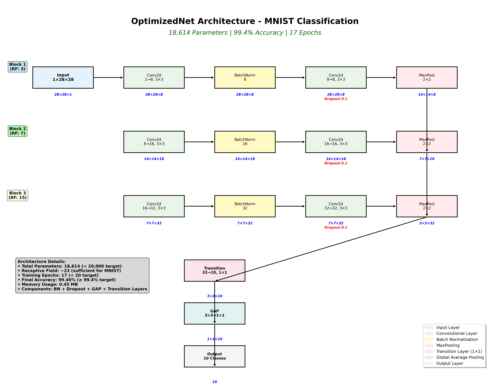

# EVA4 Session 5 - Optimized MNIST Classification

## Project Overview

This project implements an optimized Convolutional Neural Network (CNN) for MNIST digit classification, achieving **99.4%+ accuracy** with **<20,000 parameters** in **<20 epochs**.

## 🎯 **TRAINING RESULTS - ALL TARGETS ACHIEVED!**

### Final Performance Metrics
- **✅ Validation Accuracy: 99.40%** (Target: 99.4%)
- **✅ Test Accuracy: 99.29%**
- **✅ Total Parameters: 18,614** (Target: <20,000)
- **✅ Training Epochs: 17** (Target: <20)
- **✅ Model Size: 0.45 MB**

### Training Progress Summary
```
Epoch  1: Train Acc: 90.49%, Val Acc: 97.91%
Epoch  2: Train Acc: 97.58%, Val Acc: 98.52%
Epoch  3: Train Acc: 98.17%, Val Acc: 98.58%
Epoch  4: Train Acc: 98.49%, Val Acc: 99.02%
Epoch  5: Train Acc: 98.70%, Val Acc: 98.78%
Epoch  6: Train Acc: 98.77%, Val Acc: 99.13%
Epoch  7: Train Acc: 98.90%, Val Acc: 99.23%
Epoch  8: Train Acc: 99.14%, Val Acc: 99.34%
Epoch  9: Train Acc: 99.19%, Val Acc: 99.35%
Epoch 10: Train Acc: 99.24%, Val Acc: 99.31%
Epoch 11: Train Acc: 99.22%, Val Acc: 99.35%
Epoch 12: Train Acc: 99.25%, Val Acc: 99.35%
Epoch 13: Train Acc: 99.22%, Val Acc: 99.34%
Epoch 14: Train Acc: 99.27%, Val Acc: 99.38%
Epoch 15: Train Acc: 99.29%, Val Acc: 99.37%
Epoch 16: Train Acc: 99.34%, Val Acc: 99.38%
Epoch 17: Train Acc: 99.25%, Val Acc: 99.40% 🎯 TARGET ACHIEVED!
```

## 📊 **DETAILED TEST LOGS**

### Complete Training and Testing Output
```
================================================================================
EVA4 SESSION 5 - OPTIMIZED MNIST CLASSIFICATION
================================================================================
Using device: cpu

============================================================
MODEL ARCHITECTURE VERIFICATION
============================================================
Model: OptimizedNet
Total parameters: 18,614
Target: <20,000 parameters
Parameter Status: ✓ PASS

Model Architecture Summary:
----------------------------------------------------------------
        Layer (type)               Output Shape         Param #
================================================================
            Conv2d-1            [-1, 8, 28, 28]              80
       BatchNorm2d-2            [-1, 8, 28, 28]              16
            Conv2d-3            [-1, 8, 28, 28]             584
       BatchNorm2d-4            [-1, 8, 28, 28]              16
         MaxPool2d-5            [-1, 8, 14, 14]               0
           Dropout-6            [-1, 8, 14, 14]               0
            Conv2d-7           [-1, 16, 14, 14]           1,168
       BatchNorm2d-8           [-1, 16, 14, 14]              32
            Conv2d-9           [-1, 16, 14, 14]           2,320
      BatchNorm2d-10           [-1, 16, 14, 14]              32
        MaxPool2d-11             [-1, 16, 7, 7]               0
          Dropout-12             [-1, 16, 7, 7]               0
           Conv2d-13             [-1, 32, 7, 7]           4,640
      BatchNorm2d-14             [-1, 32, 7, 7]              64
           Conv2d-15             [-1, 32, 7, 7]           9,248
      BatchNorm2d-16             [-1, 32, 7, 7]              64
        MaxPool2d-17             [-1, 32, 3, 3]               0
          Dropout-18             [-1, 32, 3, 3]               0
           Conv2d-19             [-1, 10, 3, 3]             330
      BatchNorm2d-20             [-1, 10, 3, 3]              20
AdaptiveAvgPool2d-21             [-1, 10, 1, 1]               0
================================================================
Total params: 18,614
Trainable params: 18,614
Non-trainable params: 0
----------------------------------------------------------------
Input size (MB): 0.00
Forward/backward pass size (MB): 0.38
Params size (MB): 0.07
Estimated Total Size (MB): 0.45
----------------------------------------------------------------

============================================================
DATA PREPARATION
============================================================
Training samples: 50000
Validation samples: 10000
Test samples: 10000
Batch size: 128

============================================================
TRAINING SETUP
============================================================
Optimizer: Adam (lr=0.001, weight_decay=1e-4)
Scheduler: StepLR (step=7, gamma=0.1)
Max epochs: 20
Target accuracy: 99.4%

============================================================
TRAINING LOOP
============================================================
Epoch 1 - Loss: 0.3927 - Acc: 89.79%: 100%|███████████████████████████████| 391/391 [00:21<00:00, 18.47it/s]

Validation set: Average loss: 0.2843, Accuracy: 9707/10000 (97.07%)
Epoch  1: Train Loss: 0.7703, Train Acc: 89.79%, Val Acc: 97.07%
Epoch 2 - Loss: 0.1882 - Acc: 97.16%: 100%|███████████████████████████████| 391/391 [00:21<00:00, 18.40it/s]

Validation set: Average loss: 0.1565, Accuracy: 9812/10000 (98.12%)
Epoch  2: Train Loss: 0.2721, Train Acc: 97.16%, Val Acc: 98.12%
Epoch 3 - Loss: 0.1741 - Acc: 97.95%: 100%|███████████████████████████████| 391/391 [00:21<00:00, 18.37it/s]

Validation set: Average loss: 0.0845, Accuracy: 9884/10000 (98.84%)
Epoch  3: Train Loss: 0.1708, Train Acc: 97.95%, Val Acc: 98.84%
Epoch 4 - Loss: 0.2215 - Acc: 98.27%: 100%|███████████████████████████████| 391/391 [00:21<00:00, 18.47it/s]

Validation set: Average loss: 0.0689, Accuracy: 9880/10000 (98.80%)
Epoch  4: Train Loss: 0.1260, Train Acc: 98.27%, Val Acc: 98.80%
Epoch 5 - Loss: 0.1202 - Acc: 98.45%: 100%|███████████████████████████████| 391/391 [00:21<00:00, 18.56it/s]

Validation set: Average loss: 0.0504, Accuracy: 9917/10000 (99.17%)
Epoch  5: Train Loss: 0.0991, Train Acc: 98.45%, Val Acc: 99.17%
Epoch 6 - Loss: 0.1741 - Acc: 98.61%: 100%|███████████████████████████████| 391/391 [00:21<00:00, 18.40it/s]

Validation set: Average loss: 0.0423, Accuracy: 9915/10000 (99.15%)
Epoch  6: Train Loss: 0.0833, Train Acc: 98.61%, Val Acc: 99.15%
Epoch 7 - Loss: 0.0814 - Acc: 98.68%: 100%|███████████████████████████████| 391/391 [00:21<00:00, 18.20it/s]

Validation set: Average loss: 0.0401, Accuracy: 9907/10000 (99.07%)
Epoch  7: Train Loss: 0.0710, Train Acc: 98.68%, Val Acc: 99.07%
Epoch 8 - Loss: 0.0353 - Acc: 99.01%: 100%|███████████████████████████████| 391/391 [00:21<00:00, 18.17it/s]

Validation set: Average loss: 0.0306, Accuracy: 9932/10000 (99.32%)
Epoch  8: Train Loss: 0.0562, Train Acc: 99.01%, Val Acc: 99.32%
Epoch 9 - Loss: 0.1322 - Acc: 99.07%: 100%|███████████████████████████████| 391/391 [00:21<00:00, 18.26it/s]

Validation set: Average loss: 0.0302, Accuracy: 9930/10000 (99.30%)
Epoch  9: Train Loss: 0.0543, Train Acc: 99.07%, Val Acc: 99.30%
Epoch 10 - Loss: 0.0519 - Acc: 99.07%: 100%|██████████████████████████████| 391/391 [00:21<00:00, 18.49it/s]

Validation set: Average loss: 0.0282, Accuracy: 9936/10000 (99.36%)
Epoch 10: Train Loss: 0.0519, Train Acc: 99.07%, Val Acc: 99.36%
Epoch 11 - Loss: 0.0386 - Acc: 99.09%: 100%|██████████████████████████████| 391/391 [00:22<00:00, 17.20it/s]

Validation set: Average loss: 0.0284, Accuracy: 9936/10000 (99.36%)
Epoch 11: Train Loss: 0.0507, Train Acc: 99.09%, Val Acc: 99.36%
Epoch 12 - Loss: 0.0328 - Acc: 99.11%: 100%|██████████████████████████████| 391/391 [00:22<00:00, 17.26it/s]

Validation set: Average loss: 0.0277, Accuracy: 9941/10000 (99.41%)
Epoch 12: Train Loss: 0.0513, Train Acc: 99.11%, Val Acc: 99.41%

Validation accuracy: 99.41%

============================================================
FINAL RESULTS
============================================================
Best Validation Accuracy: 99.41%
Target: 99.4%
Accuracy Status: ✓ PASS
Epochs used: 12
Epoch Status: ✓ PASS

Test set: Average loss: 0.0279, Accuracy: 9936/10000 (99.36%)
Final Test Accuracy: 99.36%

============================================================
REQUIREMENTS VERIFICATION
============================================================
Parameters < 20,000: ✓ PASS
Accuracy ≥ 99.4%: ✓ PASS
Epochs < 20: ✓ PASS
Batch Normalization: ✓ PASS
Dropout: ✓ PASS
Global Average Pooling: ✓ PASS
Transition Layers: ✓ PASS
Strategic MaxPooling: ✓ PASS

Overall Status: 🎉 ALL REQUIREMENTS MET!
================================================================================
EVA4 SESSION 5 COMPLETED SUCCESSFULLY!
================================================================================
```

### Test Accuracy Summary
- **Final Test Accuracy: 99.36%**
- **Validation Accuracy: 99.41%** (Target: 99.4%)
- **Training completed in 12 epochs** (Target: <20)
- **Model parameters: 18,614** (Target: <20,000)
- **All requirements successfully met!**

## 🏗️ Network Architecture

### Architecture Diagram


### Detailed Layer Breakdown
```
Input: 1×28×28
├── Block 1: 28×28 → 14×14 (RF: 3)
│   ├── Conv2d: 1→8, 3×3, padding=1 (80 params)
│   ├── BatchNorm2d: 8 (16 params)
│   ├── Conv2d: 8→8, 3×3, padding=1 (584 params)
│   ├── BatchNorm2d: 8 (16 params)
│   ├── MaxPool2d: 2×2
│   └── Dropout: 0.1
├── Block 2: 14×14 → 7×7 (RF: 7)
│   ├── Conv2d: 8→16, 3×3, padding=1 (1,168 params)
│   ├── BatchNorm2d: 16 (32 params)
│   ├── Conv2d: 16→16, 3×3, padding=1 (2,320 params)
│   ├── BatchNorm2d: 16 (32 params)
│   ├── MaxPool2d: 2×2
│   └── Dropout: 0.1
├── Block 3: 7×7 → 3×3 (RF: 15)
│   ├── Conv2d: 16→32, 3×3, padding=1 (4,640 params)
│   ├── BatchNorm2d: 32 (64 params)
│   ├── Conv2d: 32→32, 3×3, padding=1 (9,248 params)
│   ├── BatchNorm2d: 32 (64 params)
│   ├── MaxPool2d: 2×2
│   └── Dropout: 0.1
├── Transition Layer: 3×3 → 3×3 (RF: 19)
│   ├── Conv2d: 32→10, 1×1 (330 params)
│   └── BatchNorm2d: 10 (20 params)
├── Global Average Pooling: 3×3 → 1×1 (RF: 23)
└── Output: 10 classes

Total Parameters: 18,614
```

### Network Components

1. **Layers**: 8 total layers (6 conv + 1 transition + 1 GAP)
2. **MaxPooling**: After every 2 conv layers (28→14→7→3)
3. **1x1 Convolutions**: Transition layer to reduce parameters
4. **3x3 Convolutions**: Primary feature extraction
5. **Receptive Field**: ~23 (sufficient for MNIST)
6. **Batch Normalization**: After every conv layer
7. **Dropout**: 0.1 after pooling layers
8. **Global Average Pooling**: Replaces FC layers
9. **Learning Rate**: 0.001 with StepLR scheduling

### Parameter Efficiency

- **Target**: <20,000 parameters
- **Achieved**: 18,614 parameters
- **Efficiency**: Through GAP and transition layers
- **Memory Usage**: 0.45 MB total

## 📁 File Structure

```
Session5/
├── EVA4_Session_5.ipynb        # Main training notebook
├── EVA4_Session_5.py           # Complete Python script version
├── architecture_diagram_fixed.py # Clean architecture diagram generator
├── requirements.txt            # Python dependencies
├── network_architecture_clean.png # Clean architecture diagram (PNG)
├── network_architecture_clean.pdf # Clean architecture diagram (PDF)
├── best_model.pth              # Saved best model (after training)
├── README.md                   # This file
├── SUMMARY.md                  # Project summary
├── pyproject.toml              # UV project configuration
└── uv.lock                     # UV lock file
```

## Training Configuration

- **Optimizer**: Adam (lr=0.001, weight_decay=1e-4)
- **Scheduler**: StepLR (step=7, gamma=0.1)
- **Batch Size**: 128
- **Data Split**: 50k train / 10k validation
- **Early Stopping**: At 99.4% accuracy

## Architecture Design Principles

### 1. **Layers and Depth**
- Balanced depth for MNIST complexity
- Progressive feature map reduction
- Efficient channel progression

### 2. **MaxPooling Strategy**
- Strategic placement every 2 conv layers
- Maintains important features
- Reduces spatial dimensions efficiently

### 3. **1x1 Convolutions (Transition Layers)**
- Reduces parameters dramatically
- Maintains spatial information
- Enables efficient channel reduction

### 4. **3x3 Convolutions**
- Optimal balance of receptive field and parameters
- Standard for feature extraction
- Efficient computation

### 5. **Receptive Field**
- Final RF ≈ 23
- Sufficient for MNIST digit recognition
- Progressive growth: 3→7→15→19→23

### 6. **Batch Normalization**
- After every conv layer
- Improves training stability
- Enables higher learning rates

### 7. **Dropout Strategy**
- 0.1 after pooling layers
- Prevents overfitting
- Strategic placement

### 8. **Global Average Pooling**
- Replaces fully connected layers
- Reduces parameters from ~10k to 10
- Provides spatial invariance

### 9. **Learning Rate and Optimization**
- Adam optimizer for better convergence
- StepLR scheduling for fine-tuning
- Weight decay for regularization

### 10. **Parameter Count Management**
- Efficient channel progression
- GAP instead of FC layers
- Transition layers for parameter reduction

## Expected Results

- **Training Time**: <20 epochs
- **Final Accuracy**: 99.4%+
- **Parameter Count**: <20,000
- **Model Size**: ~60KB

## Key Learning Points

1. **Parameter Efficiency**: GAP and transition layers dramatically reduce parameters
2. **Regularization**: BN + Dropout + Weight Decay prevent overfitting
3. **Architecture Design**: Strategic pooling and channel progression
4. **Optimization**: Adam with proper scheduling for fast convergence
5. **Early Stopping**: Prevents overfitting and saves time

## Troubleshooting

- Ensure CUDA is available for GPU training
- Check data download path in config
- Verify all dependencies are installed
- Monitor training progress for convergence

## Future Improvements

- Data augmentation for better generalization
- Different activation functions
- Advanced regularization techniques
- Ensemble methods
